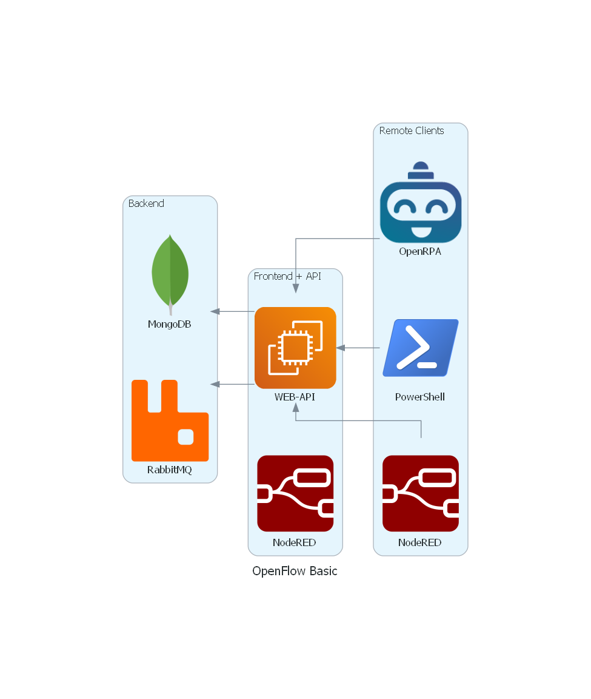
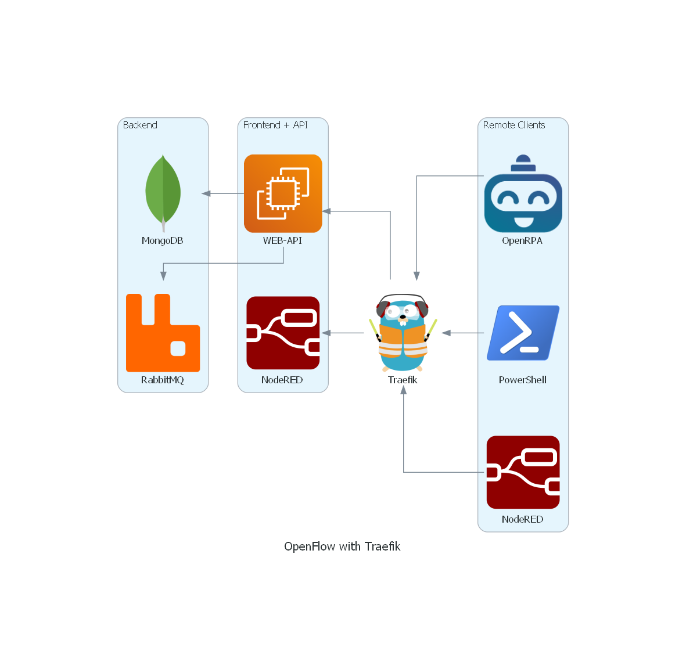
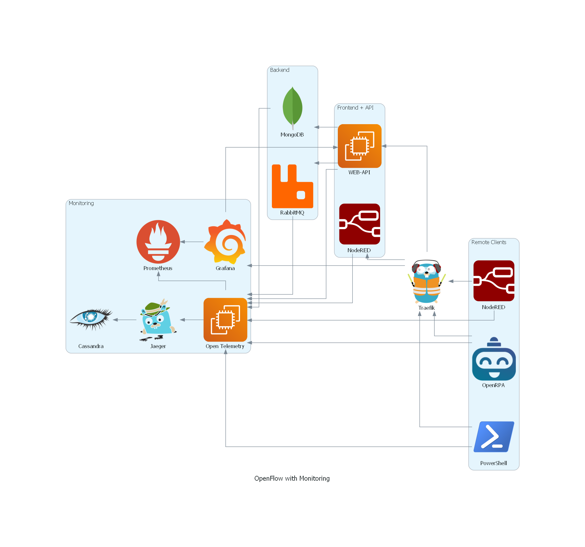

## Architecture

OpenFlow is an extendible stack, it's core components consist of a [MongoDB](https://www.mongodb.com/) database (preferably a replica set to allow support for change streams )
A stateless [RabbitMQ](https://www.rabbitmq.com/) (but if needed you can run with durable queues and persistent storage)
And the OpenFlow API and web interface.
If deployed in docker, you can the spin up multiple NodeRED instances using the API or from the we interface.
Different types of clients, [custom web](https://github.com/open-rpa/openflow-web-angular11-template) interfaces, [OpenRPA](https://github.com/open-rpa/openrpa) robots, PowerShell modules and remotely installed NodeRED's can then connect to the OpenFlow API using web sockets and receive events and data. Clients will use the API to register/publish queues and exchanges in order to add an extra layer of authentication and to simply for network requirements. All database access is exposed as natively close to the MongoDB driver, but with an added layer of security though the API

If installed [using NPM](https://openflow.openiap.io/npmopenflow) or the basic [docker-compose](https://github.com/open-rpa/openflow/blob/master/docker-compose.yml) file that would like something like this

But for most people you should go for the docker install using [traefik](https://traefik.io/) as an ingress controller/reverse proxy. This way we can segregate internal traffic that only OpenFlow should know about from traffic going in and out to the rest of the network/world. That will look something like below

For bigger installations we recommend using kubernetes. Besides adding easy access for running geo distributed installation ( multiple data centers ) it also adds more layers of security and much needed fault tolerance and scalability. This is usually also when we want to add better monitoring of the core components and support for designing graphs and dashboard based on data in OpenFlow.

